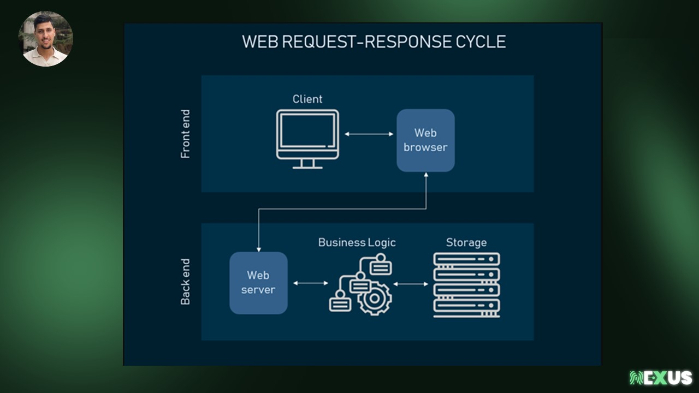
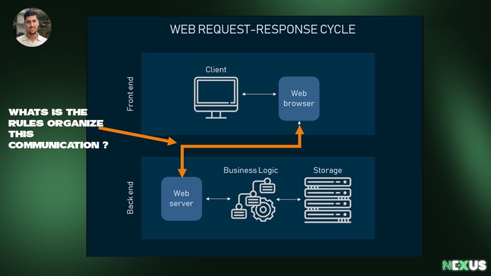
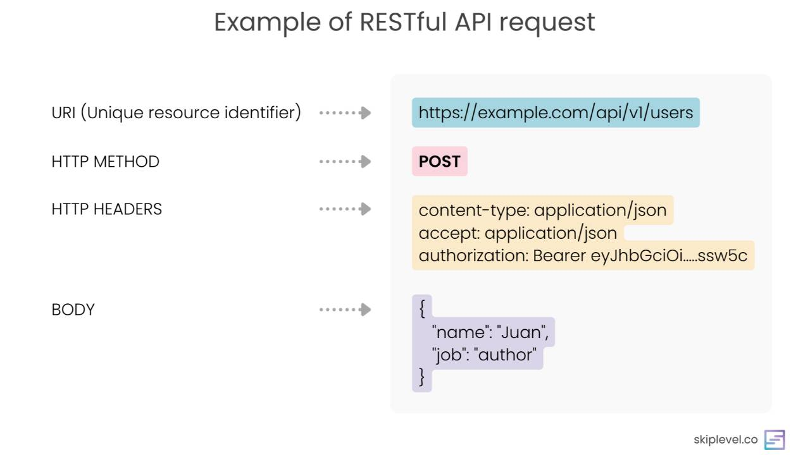
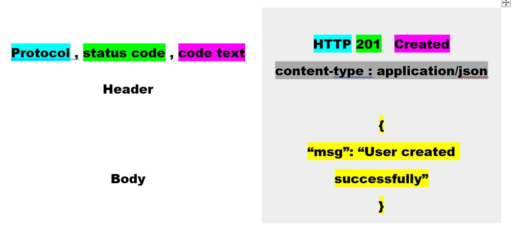
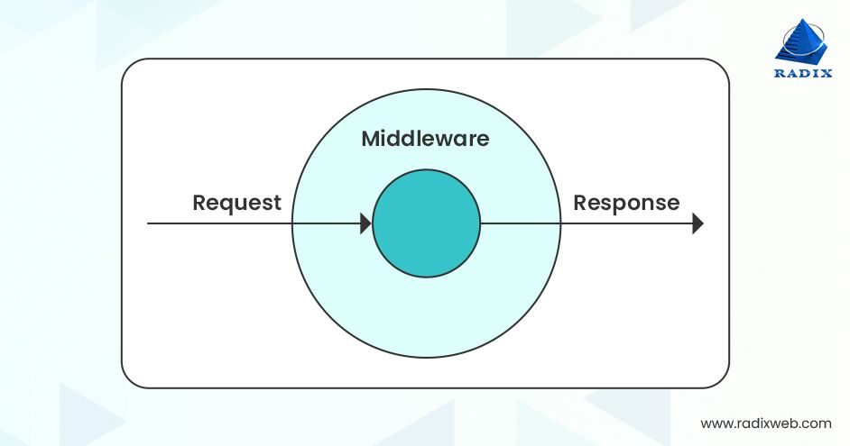
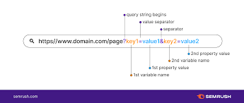

# NexCamp-2024 - Backend Workshop

## Session 01


### Topics Covered:
1. **Introduction to Web Development**
2. **Backend Development Essentials**
3. **APIs and HTTP Methods**
4. **Setting Up Node.js and Express.js**
5. **Creating and Testing a Basic REST API**
6. **HTTP Status Codes and Error Handling**
7. **Working with Data Formats (JSON)**


## 1. Introduction to Web Development

### Web Statistics and Importance
- **Web Statistics**: There are over 2 billion websites in existence, but only around 400 million of them are actively maintained. This shows the huge demand for web development and ongoing maintenance of online systems.
  
- **Why Learn Web Development?**: In today’s digital world, web development skills are essential. By learning both frontend and backend technologies .

### Frontend vs. Backend Development
- **Frontend**:  referring to everything users interact with directly in their browser. It includes elements like layouts, fonts, colors, buttons (client side).

- **Backend**: The part of the application that handles data storage, application logic, and communication between the frontend and database (server side).

### Core Web Technologies
- **Frontend Technologies**:
  - **HTML**: Structures the content on the web page.
  - **CSS**: Styles the web page content (colors, layout, fonts).
  - **JavaScript**: Adds interactivity and dynamic functionality to web pages.

- **Backend Technologies**:
  - PHP
  - javascript
  - Python
  - go 
  - Rust

###  JavaScript
JavaScript was originally created to run in the browser, allowing web developers to create interactive, dynamic user interfaces. 


### how Backend and Frontend communicate  



## 2. Understanding APIs (Application Programming Interfaces)

### What is an API?
- **Definition**: An API is a set of **rules** and **protocols** that allows different software applications to communicate with each other.


### Types of APIs: RESTful APIs
- **RESTful API**: This is a architecture for designing networked applications.  It uses standard HTTP methods to perform CRUD operations on resources.
  - **GET**: Retrieves data.
  - **POST**: Submits data for creation.
  - **PUT**: Updates data.
  - **DELETE**: Removes data.
### Request and Response Structure
  - **Request**:

  - **Response**:

  - **Request**:
    ```http
    GET http://company.com/api/v2/users HTTP1.1
    ```
    This fetches a list of users.
another example

  - **Response**:
    ```http
    HTTP/1.1 200 OK
    Content-Type: application/json
    [
      {
        "name": "Ahmed",
        "age": 10,
        "city": "Tiziouzou"
      },
      {
        "name": "Achraf",
        "age": 20,
        "city": "Khenchela"
      },
      {
        "name": "Bodja",
        "age": 30,
        "city": "setif"
      }
    ]
    ```
    The server responds with a `200 OK` status and the data in JSON format.
    ### Tools for Working with APIs
To interact with APIs, developers commonly use tools that help in making requests, viewing responses, and debugging:
- **Postman**: A popular tool for testing APIs, allowing users to send HTTP requests and view responses in a user-friendly interface.
- **cURL**: A command-line tool for making HTTP requests, often used in terminal-based workflows.
- **Thunder Client**: A lightweight API testing extension for Visual Studio Code, providing an easy-to-use interface for making requests, viewing responses, and organizing API collections without leaving the code editor.

**Task 1**:

 Use the provided URL to make a `GET` request. This request should retrieve data from the specified endpoint. Try using tools like Postman or writing code to complete this task.
[endpoints](http://api.aladhan.com/v1/hijriCalendarByCity/1446/2?country=dz&city=khenchela)

## 3. Setting Up the Development Environment

### Backend Components
- **Server**: A server listens for incoming requests from clients or frontend.
  
- **Database**: A database is used to store and manage data. Popular databases include MySQL, MongoDB, and PostgreSQL. These databases interact with the backend server to retrieve, modify, and store data.

### Setting Up Node.js
- **Node.js**: Node.js is a JavaScript runtime that enables JavaScript to run on the server-side (outside the browser). Originally, JavaScript could only run in a browser, but Node.js makes it possible to use it on your machine.

For a brief overview of JavaScript, click here: [Link text Here](https://github.com/achrafness/NexCamp-2024/blob/main/00-basics-js/basics.md)

**Task 2**:
1. Declare two variables, `a` and `b`, with values 10 and 20, respectively.
2. Declare a constant variable `name`.
3. Use `console.log()` to:
   - Output the values of `a` and `b`.
   - Print "Hello World!".
   - Print the sum: `result of a + b = 30`.

**Task 2 Solution**
```js
// Declare variables
let a = 10;
let b = 20;
const name = "Your Name";

// Output the values of `a` and `b`
console.log("Value of a:", a);
console.log("Value of b:", b);

// Print "Hello World!"
console.log("Hello World!");

// Print the sum of `a` and `b`
console.log(`Result of a + b = ${a + b}`);
```
## 4. Building a Basic Backend with Express.js

### Introduction to Express.js
- **Express.js**: Express is framework that simplifies backend development. It provides tools to handle HTTP requests, routing, and middleware functions, making it easier to build scalable and maintainable web applications.


### Understanding package.json
- **Purpose of `package.json`**: The `package.json` file holds metadata about your project, including its dependencies (libraries and frameworks), scripts, and project settings.
  
  - To create `package.json`, use:
    ```bash
    npm init
    ```
    This initializes a new Node.js project.
  - To install Express, use:
    ```bash
    npm install express
    ```

### Creating a Basic Express App

1. **Initialize the Project**:
   - In your project directory, run:
     ```bash
     npm init -y
     ```
     This will create a `package.json` file.

2. **Install Express**:
   - Install Express with:
     ```bash
     npm install express
     ```

3. **Create a Basic Server**:
   - In the root directory, create a file named `server.js` (or `app.js`).
   - Add the following code to set up the basic server:

     ```javascript
     const express = require('express');
     const app = express();
     const PORT = 3000;

     // Basic route for the root URL (localhost:3000)
     app.get('/', (req, res) => {
       res.send('Hello World!');
     });


     // Start the server and listen on the specified port
     app.listen(PORT, () => {
       console.log(`Server is running on http://localhost:${PORT}`);
     });
     ```
    - why we use spcfic port 
    - and why we use listen 
4. **Run the Server**:
   - In your terminal, start the server by running:
     ```bash
     node server.js
     ```
   - You should see the message: `Server is running on http://localhost:3000`.

5. **Test the Server**:
   - Open a browser or use a tool like cURL, Postman, or Thunder Client to make requests to:
     - `http://localhost:3000/` to see "Hello World!"

This basic server is set up to handle GET requests and respond with simple text.

**Task 3**:
1. Create a simple Express app.
2. Define two GET routes:
   - `/`: Respond with "Hello World!"
   - `/api`: Respond with "Hello from another world!"
3. Make the app listen on port `3000` and log a success message when the server starts.

**Task 3 Solution**:
```javascript
const express = require('express');
const app = express();

app.get('/', (req, res) => {
  res.send('Hello World!');
});

app.get('/api', (req, res) => {
  res.send('Hello from another world!');
});

app.listen(3000, () => {
  console.log('Server is running on port 3000');
});
```


## 5. Understanding HTTP Status Codes

### What are HTTP Status Codes?
- **Purpose**: HTTP status codes are three-digit numbers sent by the server to indicate the result of the request. They help clients understand if their request was successful, failed, or if further action is required.

### Status Code Categories:
- **1xx**: Informational responses (e.g., `100 Continue`)
- **2xx**: Success (e.g., `200 OK`, `201 Created`)
- **3xx**: Redirection (e.g., `301 Moved Permanently`)
- **4xx**: Client errors (e.g., `400 Bad Request`, `404 Not Found`)
- **5xx**: Server errors (e.g., `500 Internal Server Error`)

**Key Status Codes**:
- `200 OK`: The request was successful.
- `201 Created`: A new resource was created successfully.
- `400 Bad Request`: The request was malformed or invalid.
- `404 Not Found`: The requested resource could not be found.
- `500 Internal Server Error`: There was a server error while processing the request.

**Task 4**:
- Configure routes to return different HTTP status codes:
  - `GET /`: return `200 OK` with "Hello World"
  - `POST /`: return `201 Created`
  - `GET /bad`: return `400 Bad Request`
  - `GET /not-found`: return `404 Not Found`
  - `GET /error`: return `500 Internal Server Error`

**Task 4 Solution**:
```js
// read
app.get("/", (req, res) => {
    res.status(200).send("Hello World");
})
// create
app.post("/", (req, res) => {
    res.status(201).send("Hello World");
})
// Bad Request
app.get("/bad", (req, res) => {
    res.status(400).send("Bad Request");
})
// Not Found
app.get("/not-found", (req, res) => {
    res.status(404).send("Not Found");
})
// Internal Server Error
app.get("/error", (req, res) => {
    res.status(500).send("Internal Server Error");
})
```
## 6. Data Formats in Web Development

### Importance of Data Formats
- **Purpose**: Data formats like JSON and XML are used to structure data in a way that can be easily transmitted over the internet and processed by both clients and servers.

- **Popular Formats**:
  - **JSON**: JavaScript Object Notation. A lightweight, human-readable format for transmitting data.
  - **XML**: eXtensible Markup Language. A markup language that defines rules for encoding documents in a format that is both human-readable and machine-readable.

- Example JSON:
  ```json
  {
    "name": "John Doe",
    "age": 30,
    "city": "New York"
  }
  ```
- Example XML:
  ```xml
  <person>
    <name>John Doe</name>
    <age>30</age>
    <city>New York</city>
  </person>
  ```

**Task 5**:
- Add the /cars Route  define a new GET route for /cars that responds with JSON data.


**Task 5 solution**:
```js
let cars = [
  { id: 1, make: "Toyota", model: "Corolla", year: 2020 },
  { id: 2, make: "Honda", model: "Civic", year: 2021 },
];

// READ: Get all cars
app.get("/cars", (req, res) => {
  res.status(200).json(cars);
});
```

## Session 02

### Topics Covered:
1. **Recap of Key Concepts from Session 01**
2. **Key Terms and Definitions (URL Structure)**
3. **Middleware** 'task'
4. **Params vs. Query Strings**  'task'
5. **CRUD opration** 'task'

## 1. **Recap of Key Concepts from Session 01**
**fromat of the request:**
```
POST https://example.com/api/v1/users
User-Agent: Mozilla/5.0 (X11; Linux x86_64; rv:128.0) Gecko/20100101 Firefox/128.0
content-type: application/json
accept: application/json
{ 
  "name": "Juan",
  "password": "123456"
}
```
**fromat of the response:**
```
HTTP 201 Created
content-type: application/json
Content-Length: 100
{
"msg": "User createdsuccessfully"
}
```
**Task 1**:

Create an API endpoint that logs (print) request details including IP address, User-Agent, HTTP method, URL path, and Accept and return as response 'welcome'

**Task 1 solution:**
```js
app.get("/", (req, res) => {

  const ip = req.ip; 
  const userAgent = req.get("User-Agent"); 
  const method = req.method; 
  const path = req.originalUrl;
  const Accept = req.get("Accept"); 

  console.log(`************************************`);
  console.log(`IP: ${ip}`);
  console.log(`User-Agent: ${userAgent}`);
  console.log(`Method: ${method}`);
  console.log(`Path: ${path}`);
  console.log(`Accept-Content: ${Accept}`);
  console.log(`************************************`);

  res.status(200).send("Welcome");
});

```
## 2. **Key Terms and Definitions**

### URL
```
https://example.com/api/users
```
A URL (Uniform Resource Locator) consists of the following components:

1. **Protocol**: Defines the communication method (e.g., `http`, `https`).
   - Example: `https://`
   
2. **Domain Name**: Identifies the website (e.g., `example.com`).
   - Example: `example.com`
   
   
3. **Path**: Refers to the resource's location on the server.
   - Example: `/api/users`

### Endpoints
Endpoints are specific paths on the server that are associated with particular HTTP methods (GET, POST, PUT, DELETE, etc.) to perform different actions on the resources.

Another definition:
An API endpoint is a URL that serves as the point of interaction between an API client and an API server. API clients make requests to these endpoints to access the functionality and data provided by the API.

#### Examples of endpoints:

**GET /api/users**  
   - Retrieves a list of all users from the server.  
   - Example URL: `https://example.com/api/users`

**GET /api/users/{id}**  
   - Retrieves details of a specific user based on their ID.  
   - Example URL: `https://example.com/api/users/1`
## 3. **Middleware**

### Problem:  
We need to know the **User-Agent**, **IP address**, **HTTP method**, **URL**, and **Accept-Type** in all endpoints of the application.
```js
app.get('/users', (req, res) => {
  res.send('Users list');
});

app.get('/posts', (req, res) => {
  res.send('Posts list');
});
app.get('/products', (req, res) => {
  res.send('Posts list');
});
```
### Wrong Solution:
```js
app.get('/users', (req, res) => {
  console.log(`User-Agent: ${req.get('User-Agent')}`);
  console.log(`IP Address: ${req.ip}`);
  console.log(`Method: ${req.method}`);
  console.log(`URL: ${req.originalUrl}`);
  console.log(`Accept-Type: ${req.get("Accept")}`);
  res.send('Users list');
});

app.get('/posts', (req, res) => {
  console.log(`User-Agent: ${req.get('User-Agent')}`);
  console.log(`IP Address: ${req.ip}`);
  console.log(`Method: ${req.method}`);
  console.log(`URL: ${req.originalUrl}`);
  console.log(`Accept-Type: ${req.get("Accept")}`);
  res.send('Posts list');
});
```
This solution is incorrect because it repeats the logging code in every route handler.

### What is Middleware?  
Middleware is software or functions that act as intermediaries between different components of an application. 

In the context of Express, middleware functions handle HTTP requests before they reach route handlers, which allows you to perform common tasks (like logging) for all routes.





### Structure of Middleware in Express:
Middleware in Express typically has the following structure:
```js
const middlewareName = (req, res, next) => {
  // Your middleware logic here
  next();  // Pass control to the next middleware or route handler
};
// for pass the middlware in all routes 
app.use(middlewareName())
```


### Solution:
Instead of repeating the logging code in every route, we can write a middleware function that logs the required details for all incoming requests, no matter the endpoint.

```js
const express = require('express');
const app = express();

const logRequestDetails = (req, res, next) => {
  console.log(`User-Agent: ${req.get('User-Agent')}`);
  console.log(`IP Address: ${req.ip}`);
  console.log(`Method: ${req.method}`);
  console.log(`URL: ${req.originalUrl}`);
  console.log(`Accept-Type: ${req.get("Accept")}`);
  next(); 
};

app.use(logRequestDetails); // Apply this middleware to all routes

// Define routes
app.get('/users', (req, res) => {
  res.send('Users list');
});

app.get('/posts', (req, res) => {
  res.send('Posts list');
});

app.listen(3000, () => {
  console.log('Server running on port 3000');
});
```


### Task 01:  
- Write a middleware to log the current date and time for every incoming request. 
'to get current time 'new Date().toLocaleString()' '
### Task 01 Solution :  
```javascript

const logDateTime = (req, res, next) => {
  const currentDate = new Date().toLocaleString();
  console.log(`Request received at: ${currentDate}`);
  next(); 
};

app.use(logDateTime); 

app.get('/', (req, res) => {
  res.send('Hello, Middleware with Date and Time!');
});


```
## 4. **Params vs. Query Strings**
### **URL Parameters**  

#### **Problematic Code:**
The following implementation creates a separate route for each user, which is inefficient and hard to maintain.  

```javascript
let users = [
  { id: 1, name: "user-1233" },
  { id: 2, name: "user-1652" },
  { id: 3, name: "user-1533" },
  { id: 4, name: "user-1453" },
];

app.get('/', (req, res) => {
  res.status(200).send('Test your API!');
});

app.get("/api/users", (req, res) => {
  res.status(200).json(users);
});

app.get("/api/users/1", (req, res) => {
  res.status(200).json(users[0]);
});

app.get("/api/users/2", (req, res) => {
  res.status(200).json(users[1]);
});

app.get("/api/users/3", (req, res) => {
  res.status(200).json(users[2]);
});

app.get("/api/users/4", (req, res) => {
  res.status(200).json(users[3]);
});
```


**What are Path Parameters?**
- **Included directly in the URL path** to make routes dynamic.
- Useful for accessing specific resources.
- Example: `/api/users/:id`  
  - URL: `/api/users/123`  
  - Accessed in code as `req.params.id`.


#### **Improved Implementation Using URL Parameters**  

By using URL parameters, we can create a single dynamic route to handle user retrieval.

```javascript

app.get('/', (req, res) => {
  res.status(200).send('Test your API!');
});


app.get("/api/users", (req, res) => {
  res.status(200).json(users);
});

  let users = [
    { id: 1, name: "user-1233" },
    { id: 2, name: "user-1652" },
    { id: 3, name: "user-1533" },
    { id: 4, name: "user-1453" },
  ];

app.get("/api/users/:id", (req, res) => {
  const id = req.params.id; 
  const user = users[id]
  if (!user) {
    return res.status(404).send("User not found");
  }

  res.status(200).json(user); 
});
```

### Query Parameters



Query parameters are used to pass additional information to the server and are added to the URL after a `?`.  
- Example: `/api/users?name=John&age=30`
- Accessed in code as `req.query`.

Common use cases:
- Searching
- Sorting


  ```js
  app.get('/users', (req, res) => {
  const { name } = req.query; // Extract the 'name' query parameter

  const filteredUsers = users.filter((user) => user.name === name);

  res.status(200).json(filteredUsers);
  })
  ```
### **Task 03**:  
Create an API endpoint to accept both path parameters and query  and send them as a response as json format.

### **Task 02 Solution**:

Here is the implementation where we combine both path parameters and query strings and send them as a response.

```javascript
app.get('/api/:id', (req, res) => {
  const id = req.params.id; // Path parameter
  const queryParams = req.query; // Query parameters

  res.status(200).json({
    pathParam: req.params, // Path parameter
    queryParams: queryParams, // Query parameters
  });
});
```
## 5. **CRUD Operations**

### CRUD Overview
CRUD stands for:
- **Create**: Adding new data (`POST`).
- **Read**: Retrieving data (`GET`).
- **Update**: Modifying existing data (`PUT` or `PATCH`).
- **Delete**: Removing data (`DELETE`).

### Example CRUD Routes
```javascript
const express = require('express');
const app = express();

app.use(express.json()); // Middleware to parse JSON data

let users = [];

// Create
app.post('/users', (req, res) => {
  const user = req.body;
  users.push(user);
  res.status(201).send(user);
});

// Read
app.get('/users', (req, res) => {
  
  res.status(200).send(users);
});

// Update
app.put('/users/:id', (req, res) => {
  const { id } = req.params;
  const updatedUser = req.body;
  users = users.map(user => (user.id === parseInt(id) ? updatedUser : user));
  res.send(updatedUser);
});

// Delete
app.delete('/users/:id', (req, res) => {
  const { id } = req.params;
  users = users.filter(user => user.id !== parseInt(id));
  res.send(`User with ID ${id} deleted.`);
});

app.listen(3000, () => {
  console.log('Server running on port 3000');
});
```

**Task**:
- Build a CRUD API for managing a list of tasks. Each task should have an `id`, `title`, and `isCompleted` status.

```js


```